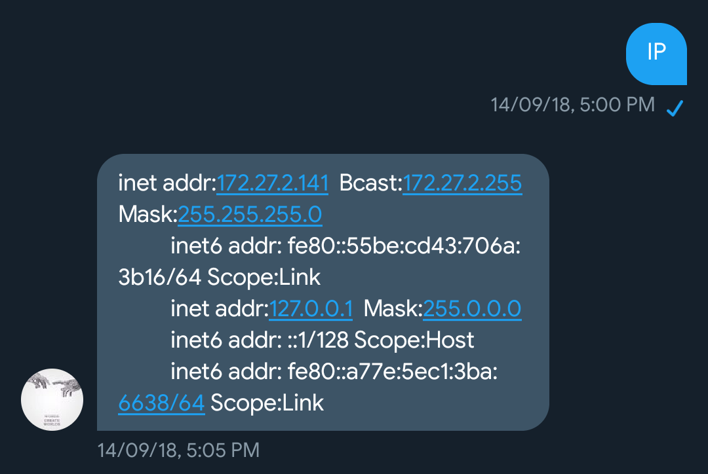

# Headless-RaspberryPi-Twitter-Controller-Bot
A simpe twitter bot that runs on raspberry pi and could return its IP address, WIFI name and more info.

# Why?
If you own a raspberrypi, it's quite normal to run it in headless mode, i.e. not having any keyboard, mouse or display connected to it. This means whatever you do is via your personal laptop/desktop with the help of ssh.

SSH requires you to know its IP Address and the network it is connected to. As long as RaspberryPi is connected to Internet, this bot makes sure to tell you (via Twitter) what is its current IP and the Network.

# How to use?  
I DM a twitter bot that is running through this program.  



The program runs as cron on frequent interval on raspberrypi and checks if a new DM has come. 
If it detects a new DM that asks for IP address Or Wifi, it DMs back with its IP address/Wifi name.

Remember the IP address returned would be local IP address. 

# Installation and Configuration

#### Requirements

**Python v3**. If you don't have python 3 default on your RaspberryPi, it is good time to shift to it as Python v2.7's support is ending in early 2020. [Here's a tutorial on how to do so.](https://linuxconfig.org/how-to-change-from-default-to-alternative-python-version-on-debian-linux)

#### Installation 

ssh into RaspberryPi (or if you have GUI then just open terminal in RaspberryPi) and work through the following commands

```shell

# clone repository
git clone https://github.com/bhavul/Headless-RaspberryPi-Twitter-Controller-Bot.git

# enter the directory
cd Headless-RaspberryPi-Twitter-Controller-Bot

# install required packages
pip install -r requirements.txt

```

#### Configuration

Since this has to run via a Twitter Bot, you need to first create a Twitter bot. This will take you some time to do. There are plenty of tutorials you could follow from the internet, however [one of my blogpost also describes this process](https://blog.bhavul.com/cracking-gre-using-a-twitter-bot/). 

Essentially, for having a Twitter bot, you need Twitter credentials, namely the following things : 

```shell
TWITTER API KEY
TWITTER API SECRET
TWITTER ACCESS TOKEN
TWITTER ACCESS TOKEN SECRET

RECEIVER TWITTER ID (account to which the bot will DM the IP Address, Wifi info)
```

Once you have the above credentials, you need to run following commands : 

```shell

# create config file
cp config_auth.properties.example config_auth.properties

```

Now, open `config_auth.properties` in your favourite editor and replace the values in it with your own Twitter Credentials. 


#### Test

Once you've followed above instructions, you should be able to test the bot.

```
python commands.py
```


#### Cron

Ideally, your RaspberryPi Twitter Bot should keep listening to you always. So, we can add a cron to our raspberrypi : 

```bash 
*/5 * * * *             /usr/bin/python /home/pi/Headless-RaspberryPi-Twitter-Controller-Bot/commands.py >> /home/pi/Headless-RaspberryPi-Twitter-Controller-Bot/cron-logs.log 2>&1
```

This will poll to check every 5 minutes if any new DM has arrived for the Twitter bot. If so, it will reply with the required info. :-) 


# Future
The code is pretty straight forward. It executes the command asked for, and returns its output, but all using twitter. You could extend this to have any other commands which you want to have executed remotely. 
